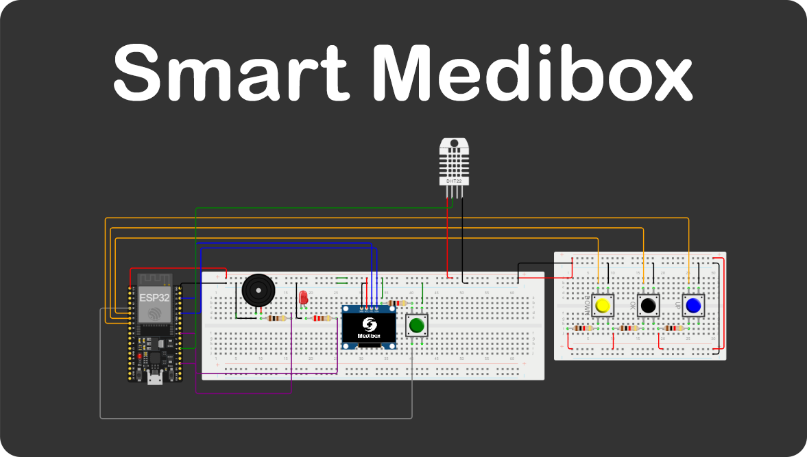

# Smart Medibox

Smart medibox is a smart device that,
1. Remind the user to take medicine at time through alarms.
2. Help to keep medicine in the required conditions via monitoring temperature and humidity continously and notifying the user if there is a bad condition.

Note : IOT part of this project is to be implemented. 

# Technologies and Components

*   This project is developed to use
    *   ADAFRUIT SSD 1306 OLED Monochrome Display (128x64)
    *   ESP32 Devkit V1
    *   DHT11 Temperature and Humidity Sensor. (Easily configurable for DHT22 aswell.)

out of the box.
If the components change, you may have to change the parameters accordingly. 
<br><br>

<div align="center">
	<code></code>
	<code></code>
	<code></code>
	<code></code>
</div>

*   This was developed using Vistual Studio Code with Arduino Framework. 

# Getting Started

## Prerequisites
*   Git
*   Arduino Framework Set up with Visual Studio Code
*   Relavant hardware for testing if you are not intended to do simulations.
<br>
<br>

*   Clone the repository.
    ```bash 
    git clone https://github.com/SasikaA073/smart-medibox-m     
    ```

*	`main.ino` contains the arduino *loop()* and *setup()* functions.

* The device code is developed in such a way that it's actively listening(polling) for user inputs and for collecting sensor data from the DHT sensor. 
*	For an instance the three function calls in loop() function is responsible for,
	1.	`update_time_with_check_alarm()` - Updates the the time on the display. Checks whether there are any alarms to be rung at the moment. Calls `ring_alarm()` inside it if there is any.

	2.	`go_to_menu()` - Activelly listening for button presses and then keeps track of the selected mode by user via an abstract variable. When user confirms a menu item via pressing OK button, the `run_mode(mode)` is called. `run_mode(mode)` handles the rest via somr another nested function calls.

	3.	`check_temp()` - Reads the data from the `DHT11` sensor, prints a warning in the display if there is any parameter that is out of the specified limits. If there isn't any, plays an animation on the screen indicating it is actively monitoring those parameters.


# Known issues

Currently there are no known issues. If there is any, please open an issue in the `issues` section with a relavant label.

# About

This project was first developed as the Semester 4 Project in the Module `EN2853 - Embedded Systems & Applications`